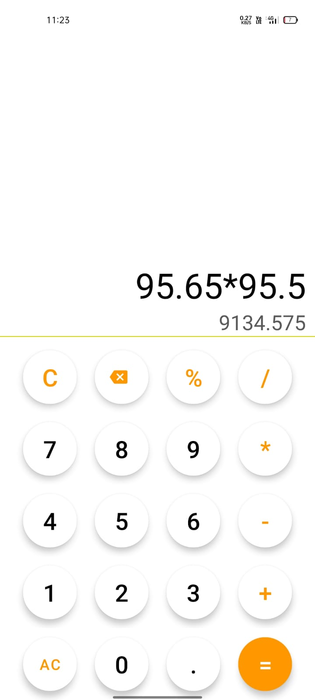
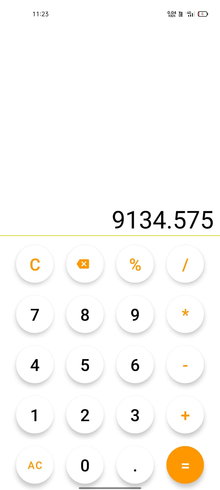

# Simple Calculator App

This is a simple calculator application developed using Kotlin and Android Studio. The app allows users to perform basic arithmetic operations, including addition, subtraction, multiplication, and division. It utilizes Kotlin's expression evaluation capabilities to parse and evaluate user-entered mathematical expressions, providing accurate results. The user-friendly interface is designed with buttons for easy input of numbers and operators, ensuring a smooth and intuitive user experience.

## Screenshots

## Key Features

- Perform addition, subtraction, multiplication, and division operations.
- Evaluate and display the result of mathematical expressions.
- User-friendly interface with intuitive input buttons.
- Error handling and validation to ensure accurate calculations and prevent crashes.
- Thorough testing and debugging for reliability and stability.
- Codebase optimized for performance, readability, and adherence to best practices and coding conventions.

## Technologies Used

- Kotlin programming language
- Android Studio

## Project Highlights

This project showcases my proficiency in Kotlin programming, Android app development, and problem-solving skills. It demonstrates my ability to design and implement user interfaces using XML layouts and Kotlin code. I leveraged Kotlin's expression evaluation functionality to accurately parse and evaluate mathematical expressions. Additionally, I implemented error handling and validation to ensure precise calculations and prevent potential crashes. Thorough testing and debugging were conducted to ensure the reliability and stability of the application. 
